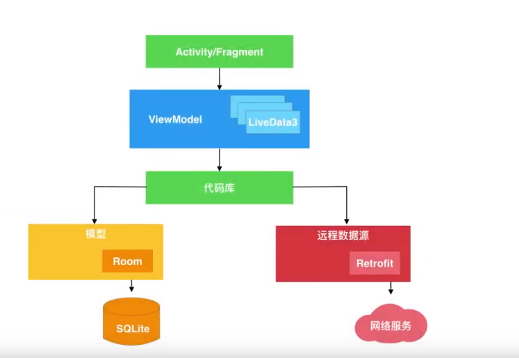

何为架构组件？

这些组件可以 用来存储数据，管理生命周期，模块化，避免内存泄漏

枯燥的样本文件代码。

基础android 应用，需要数据库 的界面

Room,ViewModel,LiveData ,LifecycleObserver 和 LifecycleOwner 

简化了操作，他们被设计成积木这样，轻松的装配在一起。

Room

Room 是一个稳健的SQL对象映射库。

通过room 建立数据库表

```
@Entity
public class Trail{
	public @PrimaryKey String id;
	public String name;
	public double kilometers;
	public int difficulty;
}
```

```
@Dao
public interface TrailDao{
	@Insert(onConfict=IGNORE)
	void insertTrail(Trail trail);
	
	@Query("select * from Trail")
	public List<Trail> findAllTrails();
	
	@Update(onConflit=REPLACE)
	void updateTrail(Trail);
	
	@Query("DELETE FROM Trail")
	void deleteAll();
}
```

 现在已经建立数据库，可以使用liveData 的新增组件，来监控数据库变化。

LiveData

LiveData 是一种可观测数据容器，它会在数据变化时通知观测器，以便您更新界面。

LiveData 是一个可扩展的抽象类，在简单的情况下，可以使用MutableLiveData 类，如果调用setValue 更新 MutableLiveData 的值，就会触发界面更新。

Room 更加强大在于，原生支持LiveData ，要组合使用两者，

例如：


```
	@Query("select * from Trail")
	public LiveData<List<Trail>> findAllTrails();
```

room 将创建 能观测 数据库的LiveData 对象。然后就可以编写这样的代码，来更新界面。

trailsLiveData.observe(this,trails->{

​	 adapter.replaceItems(trails);

​	 adapter.notifyDataSetChanged();

});

最终结果是，如果你的room 数据库有更新，会更新liveData 的数据，会自动触发界面的更新。

liveData 另外一个出色的功能，LiveData 具备观测生命周期的感知能力。

这里感知生命周期是什么意思呢？

通过生命周期观测，不必向非活动界面发送数据库更新。为此新增两个接口。LifecycleOwner 和 LifecycleObserver 。

LifecycleOwner  是具有生命周期的对象，比如是activity ,fragment 


LifecycleObserver 观测LifecycleOwner ，并在生命周期变化时收到通知。

LiveData 实现 LifecycleObserver 的简化代码

```
abstract public class LiveData<T> implements LifecycleObserver{

	@OnLifecycleEvent(Lifecycle.ON_START)
	void startup(){};
	
	@OnLifecycleEvent(Lifecycle.ON_STOP)
	void cleanup(){};
}
```


更成熟的应用可能是这样



